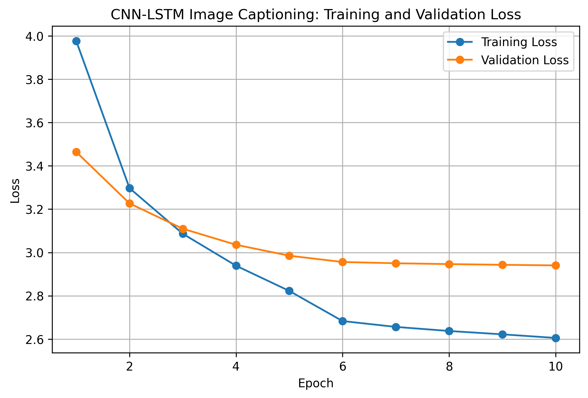
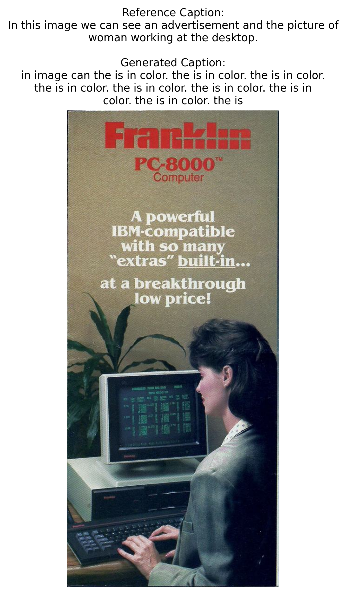
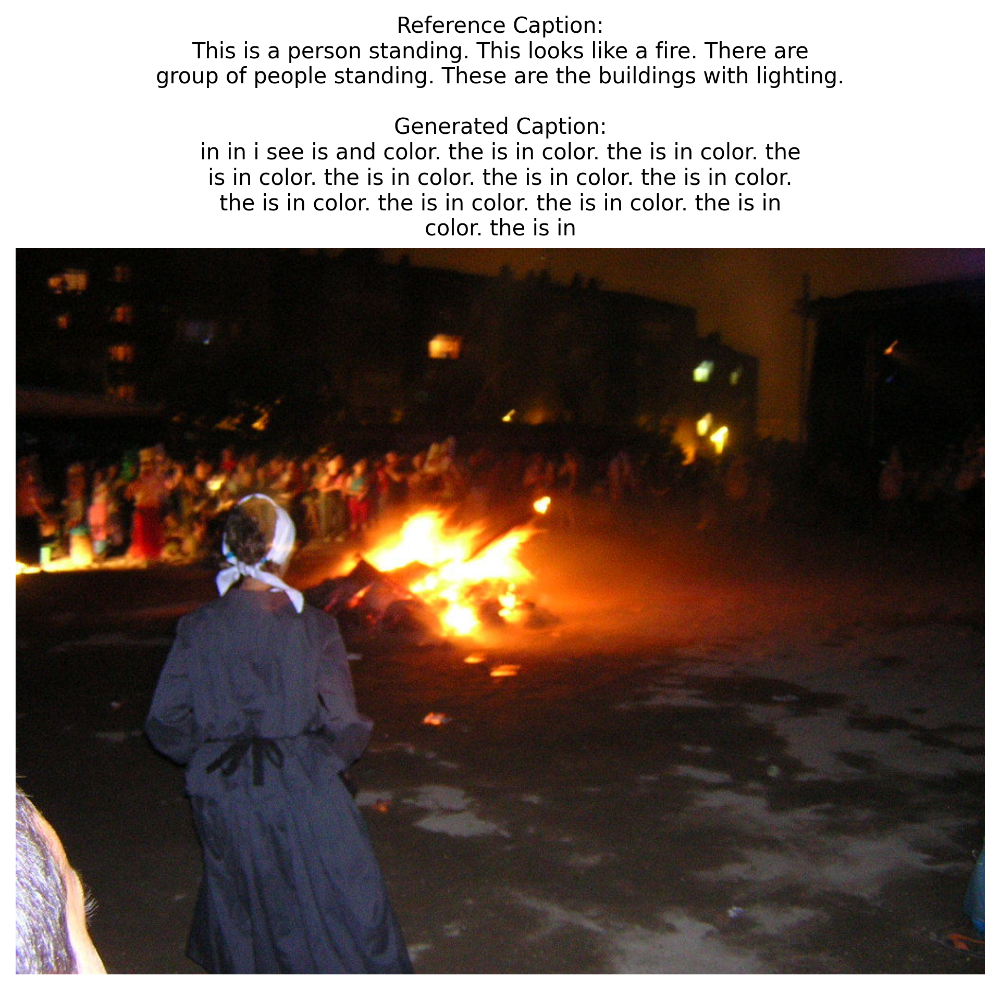
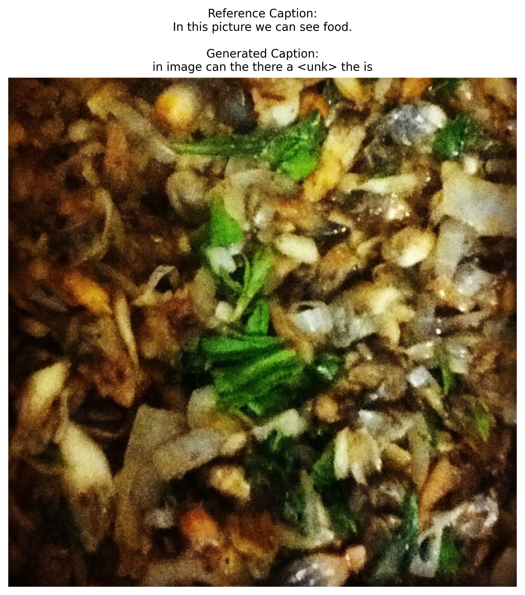

# CNN-LSTM Image Captioning System

An end-to-end deep learning image captioning system that automatically
generates natural-language descriptions for images using a pretrained
ResNet-152 CNN encoder and an LSTM decoder.

## Project Highlights

- Built an end-to-end image captioning pipeline combining computer vision and NLP.
- Used transfer learning with a pretrained ResNet-152 CNN for visual feature extraction.
- Implemented an LSTM decoder in PyTorch for sequential caption generation.
- Trained and validated the pipeline on 5,000 image-caption samples.
- Built a custom vocabulary, tokenization pipeline, Dataset, and DataLoader.
- Evaluated generated captions using BLEU-1 through BLEU-4 and ROUGE-L.
- Achieved BLEU-1 of 0.1879 and ROUGE-L of 0.2464.
- Analyzed model limitations using quantitative metrics and qualitative prediction examples.
  
## Overview

Image captioning combines computer vision and natural language processing.
This project extracts visual features from images using a pretrained
ResNet-152 convolutional neural network and passes those features to an
LSTM decoder that generates captions word by word.

The model was implemented in PyTorch and trained using 5,000
image-caption samples from the Open Images caption dataset.

## Model Architecture

The image-captioning pipeline follows:

Input Image  
↓  
Image Preprocessing (224 × 224)  
↓  
Pretrained ResNet-152 CNN  
↓  
Visual Feature Extraction  
↓  
256-Dimensional Feature Embedding  
↓  
LSTM Decoder (512 Hidden Units)  
↓  
Vocabulary Prediction  
↓  
Generated Caption

### CNN Encoder

The encoder uses a pretrained ResNet-152 model for visual feature
extraction. The pretrained convolutional backbone is frozen, while a
trainable projection layer transforms the extracted features into a
256-dimensional embedding.

### LSTM Decoder

The decoder uses:

- 256-dimensional word embeddings
- LSTM with 512 hidden units
- Fully connected output layer
- Dynamically constructed vocabulary
- Special `<start>`, `<end>`, `<pad>`, and `<unk>` tokens

The decoder generates captions sequentially based on the encoded image
representation and previously generated words.

## Dataset

The project uses image-caption annotations from the Open Images caption
dataset.

| Split | Samples |
|---|---:|
| Total | 5,000 |
| Training | 4,762 |
| Validation | 238 |

Images are downloaded using their Open Images IDs and separated into
training and validation sets.

## Training

The model was trained using:

- PyTorch
- Cross-Entropy Loss
- AdamW optimizer
- Initial learning rate of 0.001
- Reduced learning rate of 0.0001 after epoch 5
- 10 training epochs
- Transfer learning with a pretrained ResNet-152 encoder

Only the projection layers of the CNN encoder and the LSTM decoder are
trained while the pretrained ResNet backbone remains frozen.

## Training Performance

The following graph shows training and validation loss across 10 epochs.

## Caption Evaluation

Model-generated captions were evaluated using BLEU and ROUGE-L metrics.

| Metric | Score |
|---|---:|
| BLEU-1 | 0.1879 |
| BLEU-2 | 0.0258 |
| BLEU-3 | 0.0116 |
| BLEU-4 | 0.0081 |
| ROUGE-L | 0.2464 |

BLEU evaluates n-gram overlap between generated and reference captions,
while ROUGE-L evaluates sequence similarity using the longest common
subsequence.

### Evaluation Interpretation

The model achieved a BLEU-1 score of 0.1879 and a ROUGE-L score of
0.2464, indicating partial word-level and sequence-level overlap between
generated and reference captions.

The substantially lower BLEU-2, BLEU-3, and BLEU-4 scores indicate that
the model has difficulty generating longer matching word sequences.
Qualitative examples also show that some generated captions are repetitive
or grammatically incomplete.

These results highlight the limitations of training a CNN-LSTM captioning
model on a relatively small 5,000-sample subset with greedy decoding and
a single reference caption per image. They also provide a baseline for
future improvements such as attention mechanisms, beam-search decoding,
larger training datasets, and Transformer-based caption generation.

## Example Predictions

### Example 1

### Example 2

### Example 3

## Technologies

- Python
- PyTorch
- Torchvision
- ResNet-152
- LSTM
- Transfer Learning
- Natural Language Processing
- Computer Vision
- NumPy
- Pandas
- Matplotlib
- NLTK
- ROUGE Score
- Pillow

## Repository Structure

    cnn-lstm-image-captioning/
    │
    ├── image_captioning.ipynb
    ├── README.md
    ├── requirements.txt
    ├── .gitignore
    │
    ├── results/
    │   ├── loss_curve.png
    │   ├── evaluation_results.txt
    │   ├── prediction_01.png
    │   ├── prediction_02.png
    │   └── prediction_03.png
    │
    └── models/
        └── Trained model checkpoints are stored locally

### Model Checkpoints

Trained model checkpoints are not stored in this repository because of
their large file sizes. The notebook contains the complete model
architecture, training pipeline, evaluation workflow, and code required
to reproduce the model.

## Running the Project

Clone the repository:

    git clone https://github.com/YOUR-USERNAME/cnn-lstm-image-captioning.git

Install the required dependencies:

    pip install -r requirements.txt

Open the Jupyter notebook:

    jupyter notebook image_captioning.ipynb

The notebook contains the complete pipeline for dataset preparation,
image preprocessing, vocabulary creation, model training, evaluation,
and caption generation.

## Limitations

The model was trained on a relatively small subset of the available
image-caption data. Generated captions may therefore be generic,
repetitive, or inaccurate for complex scenes.

The current implementation also uses greedy decoding and a single
reference caption per evaluated image.

## Future Improvements

Potential improvements include:

- Training on a substantially larger image-caption dataset
- Beam-search decoding
- Transformer-based caption decoder
- Attention mechanisms
- Multiple reference captions per image
- Additional caption-quality metrics such as CIDEr and METEOR
- Interactive deployment using Streamlit or Gradio

## Project Context

This project originated as an image-captioning programming assignment and
was subsequently expanded into a portfolio project with a larger
5,000-sample training set, quantitative BLEU and ROUGE-L evaluation,
saved prediction examples, reproducibility documentation, and structured
GitHub project documentation.

## Author

**Arya Ingale**

M.S. Data Science  
University of North Texas
